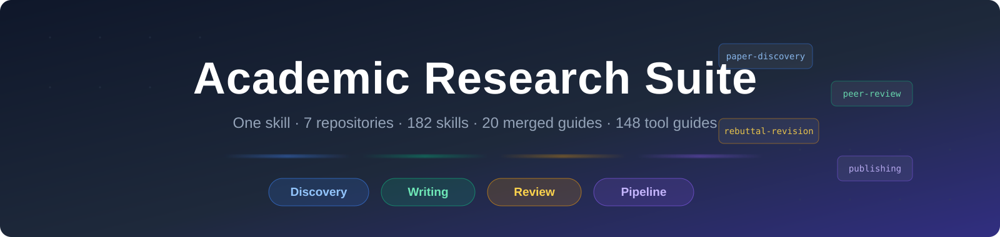
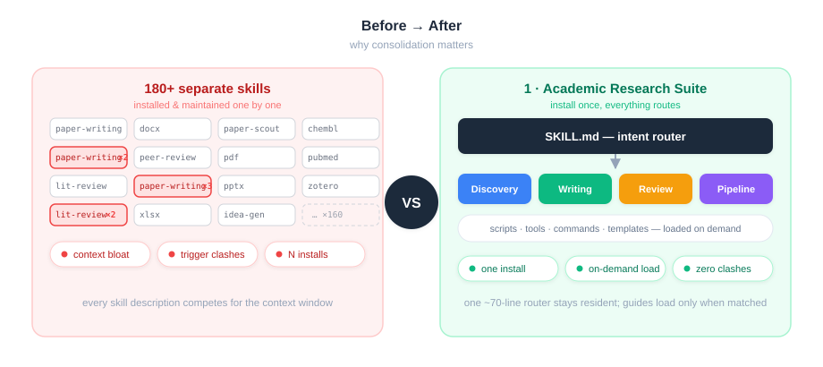
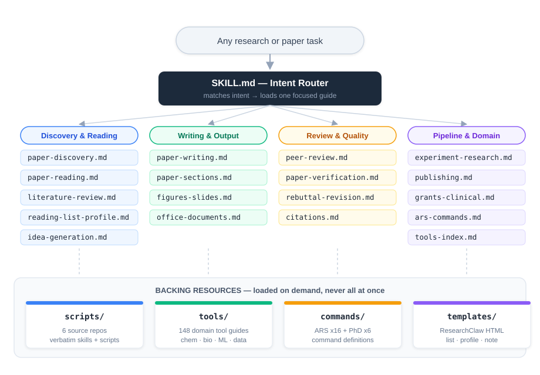
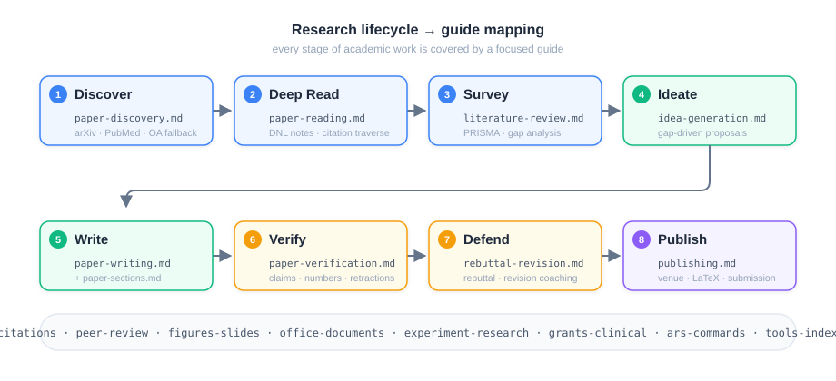
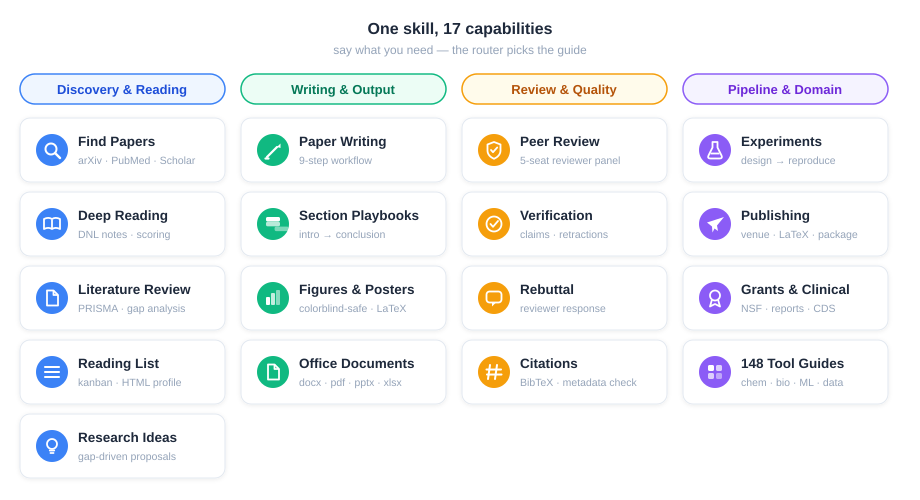

<div align="center">

# Academic Research Suite

**One skill to rule them all — 7 repositories, 186 skills, a single install.**

[](#whats-inside)
[](#whats-inside)
[](references/tools-index.md)
[](#acknowledgements)

[English](README.md) · [中文](README_zh.md)



</div>

---

## Why

Installing 180+ individual skills bloats the context window, causes trigger collisions (three `paper-writing`, two `literature-review`...), and is a pain to maintain. **Academic Research Suite** consolidates them into **one skill** with a router-style entry:

> Your request → `SKILL.md` intent router → one focused 150-400 line guide → deep resources loaded only when needed.

You install **one folder** and get the full stack: paper discovery, deep reading, literature review, idea generation, section-by-section writing, peer review, claim verification, rebuttal, experiments, publishing, figures, office documents, and 148 domain tool guides.



## Architecture



## Lifecycle coverage



## What's inside



| Domain | Guides | Highlights |
|---|---|---|
| Discovery & Reading | `paper-discovery`, `paper-reading`, `literature-review`, `reading-list-profile`, `idea-generation` | arXiv/PubMed/Scholar query building, open-access fallback chain, DNL 7-part reading notes, PRISMA screening, gap-driven proposals |
| Writing & Output | `paper-writing`, `paper-sections`, `figures-slides`, `office-documents` | 9-step writing workflow, per-section playbooks (intro/abstract/method/...), colorblind-safe figures, docx/pdf/pptx/xlsx pipelines |
| Review & Quality | `peer-review`, `paper-verification`, `rebuttal-revision`, `citations` | 5-seat reviewer panel, claim-audit tooling, retraction & tortured-phrase screening, reviewer response playbook |
| Pipeline & Domain | `experiment-research`, `publishing`, `grants-clinical`, `ars-commands`, `tools-index` | experiment design → reproduction (7 phases), venue compliance, LaTeX setup, grant/clinical reports, 148 tool guides index |
| End-to-End Pipelines | `full-pipeline`, `autoresearch-pipeline` | 12-phase thesis assembly line (intake → delivery, AUTO/STEP modes, anti-fabrication sentinel); full 23-stage autonomous research pipeline preserved from AutoResearchClaw (gates at 5/9/20, PIVOT/REFINE, self-healing experiments, 4-layer citation verification) |

## Layout

```text
academic-research-suite/
├── SKILL.md                  # intent router — always loaded, ~70 lines
├── references/               # 20 merged domain guides (the daily drivers)
│   ├── paper-discovery.md    ├── paper-writing.md      ├── peer-review.md
│   ├── paper-reading.md      ├── paper-sections.md    ├── paper-verification.md
│   ├── literature-review.md  ├── figures-slides.md    ├── rebuttal-revision.md
│   ├── reading-list-profile.md ├── office-documents.md ├── citations.md
│   ├── idea-generation.md    ├── experiment-research.md ├── publishing.md
│   ├── grants-clinical.md    ├── ars-commands.md      ├── tools-index.md
│   ├── full-pipeline.md      └── autoresearch-pipeline.md
├── tools/                    # 148 k-dense tool guides (tools/<name>/SKILL.md)
├── scripts/                  # 6 source repos, verbatim skills + scripts (incl. the ARS
│                             #   academic-paper / -reviewer / -pipeline & deep-research skills)
├── commands/                 # ARS (16) + PhD (6) command definitions
├── templates/                # ResearchClaw HTML templates
└── assets/                   # diagrams used by this README
```

## How it routes

Examples of what you can just *say*:

| You say | Guide loaded |
|---|---|
| "Find recent papers on LLM quantization" | `paper-discovery.md` |
| "Use Academic Research Suite to write my graduation thesis" | `full-pipeline.md` — 12-phase assembly line: intake → RQ → discovery → reading → outline → self-healing experiments → drafting → figures → self-review → verification → revision → DOCX delivery |
| "Write my master's thesis with the suite" | `full-pipeline.md` — 12-phase pipeline, master-thesis profile: deeper literature chapter + multiple method/experiment chapters |
| "Write my PhD thesis" | `full-pipeline.md` — phd-thesis profile as the spine (systematic survey chapter + 3-5 innovation chapters) + `experiment-research.md` for the original-experiment core; fully autonomous experiments → `autoresearch-pipeline.md` 23 stages |
| "Turn my research into an SCI journal paper and submit it" | `publishing.md` — 10-stage academic pipeline (research → write → integrity → review → revise → finalize) + venue template compliance; mid-entry supported with an existing draft |
| "Run the full AutoResearchClaw 23-stage autonomous pipeline" | `autoresearch-pipeline.md` — 8 phase groups · 3 gates · PIVOT/REFINE · self-healing experiments · 4-layer citation verification |
| "Deep-read this paper for me" | `paper-reading.md` |
| "Write the introduction for my NeurIPS paper" | `paper-sections.md` |
| "Review this manuscript as Reviewer 2" | `peer-review.md` |
| "Check if any of my citations are retracted" | `paper-verification.md` + `citations.md` |
| "Draft a rebuttal for this review" | `rebuttal-revision.md` |
| "Turn my results into a LaTeX poster" | `figures-slides.md` |
| "Query ChEMBL for this compound" | `tools-index.md` → `tools/chembl-database/` |

## 23-stage pipeline: end-to-end worked example

A worked run of `autoresearch-pipeline.md` on the topic *"LoRA vs. full fine-tuning under low-resource budgets: when is LoRA enough?"* (targeting a NeurIPS 2027 workshop). Stage numbers and gates follow the pipeline document; each stage loads the mapped suite guide.

| Stage | Guide loaded | Concrete execution (input → output) |
|---|---|---|
| 1 `TOPIC_INIT` | `idea-generation.md` | "Study the accuracy–efficiency trade-off of LoRA vs. full fine-tuning under low-resource budgets, target NeurIPS 2027" → topic statement + venue + acceptance criteria |
| 2 `PROBLEM_DECOMPOSE` | `idea-generation.md` | 3 sub-questions (trainable-parameter–accuracy curve / max batch under limited VRAM / tasks with the largest gap) → RQ brief |
| 3-4 `SEARCH_STRATEGY` → `LITERATURE_COLLECT` | `paper-discovery.md` | Real API search: `("LoRA" OR "low-rank") AND "full fine-tuning"` on arXiv/Semantic Scholar/OpenAlex → 47 hits → 41 after dedup → 23 full texts |
| 5 `LITERATURE_SCREEN` **[GATE]** | `paper-discovery.md` | Present relevance-sorted screening table: drop 6 with no baseline comparison → 17 proceed to extraction; **wait for user confirmation** ✅ |
| 6-7 `KNOWLEDGE_EXTRACT` → `SYNTHESIS` | `literature-review.md` | Extract method/baseline/conclusion per paper → evidence matrix organized by model scale × task × trainable params → locate the evidence gap |
| 8 `HYPOTHESIS_GEN` | `idea-generation.md` | Multi-perspective debate: pro "1% trainable params reach 95%+ of full fine-tuning", con "significant decay on code/reasoning tasks" → commit H1/H2/H3 |
| 9 `EXPERIMENT_DESIGN` **[GATE]** | `experiment-research.md` | Submit protocol: 3 model scales × 4 tasks × {LoRA r=8/32/64, full FT}, fixed seeds, unified eval → **wait for user confirmation** ✅ |
| 10-11 `CODE_GENERATION` → `RESOURCE_PLANNING` | `experiment-research.md` | Generate train/eval scripts with fixed seeds and structured metrics JSON → sandbox mode, single A100, ~40 GPU-hours budget |
| 12-13 `EXPERIMENT_RUN` → `ITERATIVE_REFINE` | `experiment-research.md` | `CUDA OOM` → diagnose: 3B full-FT over budget → fix: gradient accumulation + mixed precision → rerun passes (self-healing, ≤5 cycles) |
| 14 `RESULT_ANALYSIS` | `experiment-research.md` § analysis | Statistics/efficiency/generalization perspectives in parallel: classification gap <3%, code-generation gap 11.7% |
| 15 `RESEARCH_DECISION` | `experiment-research.md` § analysis | Verdict **REFINE** → add r=128 + longer training on code tasks and rerun (if contradicted → **PIVOT**, ≤1 then ask the user) |
| 16-17 `PAPER_OUTLINE` → `PAPER_DRAFT` | `paper-writing.md` + `paper-sections.md` | Outline with a claim–evidence table; draft Method → Experiments → Related Work → Intro → Conclusion → Abstract into `paper_draft.md` |
| 18-19 `PEER_REVIEW` → `PAPER_REVISION` | `peer-review.md` + `rebuttal-revision.md` | Evidence-audited panel: "Fig. 3 lacks confidence intervals", "§3.2 doesn't state the LR search range" → revision roadmap |
| 20 `QUALITY_GATE` **[GATE]** | `paper-verification.md` | Every number traceable, no NaN/Inf, citation relevance OK → **pass** ✅ |
| 21-23 `ARCHIVE_RUN` → `EXPORT_WITH_CHARTS` → `CITATION_VERIFICATION` | `citations.md` + `publishing.md` | Archive experiments and decisions → export NeurIPS-template `paper.tex` + `charts/` with error bars → 4-layer check kills 3 unverifiable citations, `references.bib` 47 → 44 |

**Deliverables from this run**

- `paper_draft.md` — full paper (Intro / Related Work / Method / Experiments / Results / Conclusion)
- `paper.tex` — NeurIPS-template LaTeX
- `references.bib` — 44 real BibTeX entries, pruned to match inline citations exactly
- `verification_report.json` — 4-layer citation integrity and relevance report
- `charts/` — condition comparison with error bars and confidence intervals
- `reviews.md` — multi-agent review with methodology–evidence consistency checks
- `evolution/` — self-learning lessons distilled from the run
- `deliverables/` — Overleaf-ready folder with all final outputs

**Choosing an experiment mode**: `simulated` (fast drafts / no environment — must be disclosed in the paper) · `sandbox` (local execution, default) · `ssh_remote` (remote GPU for heavy runs).

**Kick it off with one sentence**: just say "Run the full 23-stage autonomous pipeline on …"; the pipeline pauses at stages 5 / 9 / 20 for your confirmation (the `gate-only` mode). For zero human intervention, say "run it fully autonomous, auto-approve the gates."

## Acknowledgements

- [Research Paper Writing](https://github.com/Master-cai/Research-Paper-Writing-Skills) — section-by-section paper writing methodology (MIT)
- [ResearchClaw](https://github.com/syr-cn/ResearchClaw) — paper discovery, deep reading, reading list, research profile, idea generation (MIT)
- [Academic Research Skills](https://github.com/Imbad0202/academic-research-skills) — research-to-publication pipeline, deep research, reviewer panel + 400 scripts (CC-BY-4.0)
- [Claude Scientific Writer](https://github.com/K-Dense-AI/claude-scientific-writer) · [Scientific Agent](https://github.com/K-Dense-AI/claude-scientific-skills) — scientific writing, figures, office documents, clinical skills & 148 domain tool guides (MIT)
- [PhD Research](https://github.com/fcakyon/phd-skills) — experiment design, paper reproduction, publishing, reviewer defense (MIT)
- [Research Superpowers](https://github.com/kthorn/research-superpower) — systematic literature search, screening, citation traversal (MIT)
- [AutoResearchClaw](https://github.com/aiming-lab/AutoResearchClaw) — design source for the experiment loop, PIVOT/REFINE decisions, anti-fabrication guards, and 4-layer citation verification

## Notes

- Script-backed features (claim audits, citation API clients, document generation) need Python 3.10+ plus a few PyPI packages (`pyyaml`, `jsonschema`, `requests`, `ruamel.yaml`, `defusedxml`); PhD-skills shell guards need bash. All methodology guides are zero-dependency.
- Slim install: only `SKILL.md + references/ + commands/ + templates/` (~0.5MB) goes into the skills directory; `scripts/` and `tools/` stay in this repo and are read on demand (see the Slim install note in `SKILL.md`).
- Platform caveats: `ars-mark-read` and the LibreOffice verification wrapper are Unix-only (`fcntl` / `AF_UNIX`) — on Windows use WSL; format conversion additionally needs Pandoc.
- Merged guides are the recommended entry; verbatim copies under `scripts/` and `tools/` exist for deep dives and script access.
- Plugin hooks from original Claude plugins (session hooks) are not portable and were dropped; slash commands are preserved as documents under `commands/`.
- All paths inside guides are relative to this skill's root.

---

<div align="center">

**[English](README.md) · [中文](README_zh.md)**

</div>
